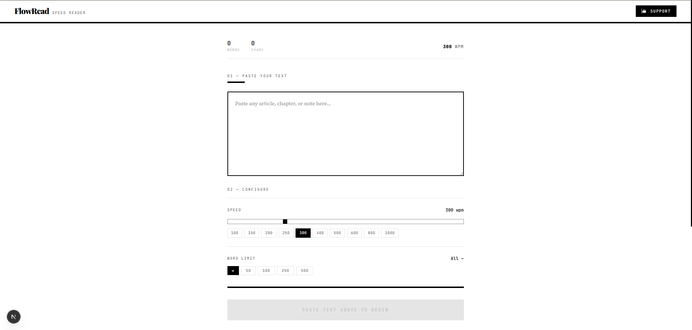

# FlowRead - Speed Reader

FlowRead is a Next.js application designed to help users read faster and improve focus by presenting text in a clean, distraction-free speed reading interface.

## Features

- Clean reading interface for better focus
- Adjustable reading speed (words per minute)
- Keyboard and UI controls to pause, resume, and reset
- Mobile-friendly layout for reading on any device
- Built with modern Next.js and TypeScript



## Getting Started

### Install dependencies

```bash
npm install
```

### Run the development server

```bash
npm run dev
```

Open [http://localhost:3000](http://localhost:3000) in your browser to view FlowRead.

## Usage

1. Enter or paste the text you want to read.
2. Set the desired reading speed.
3. Start the reader to display words one at a time.
4. Use pause, resume, and reset controls as needed.

## Build for production

```bash
npm run build
npm run start
```

## Project Structure

- `app/` – application routes and pages
- `components/` – reusable UI components
- `styles/` – global and component styles
- `public/` – static assets

## License

This project is provided as-is for use and customization.
